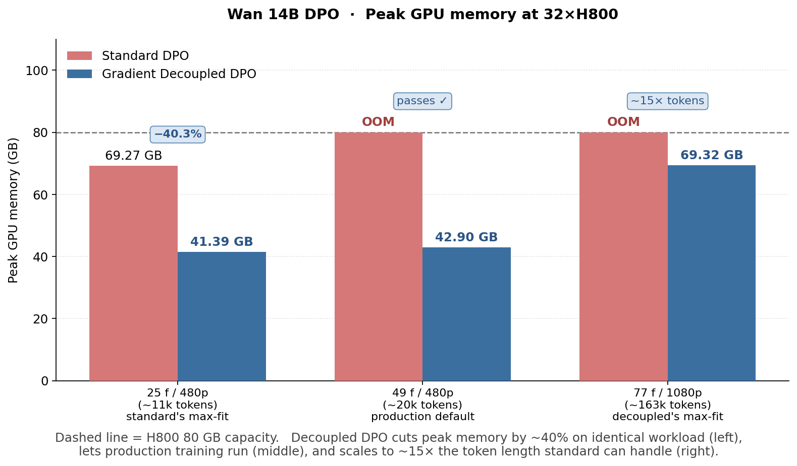
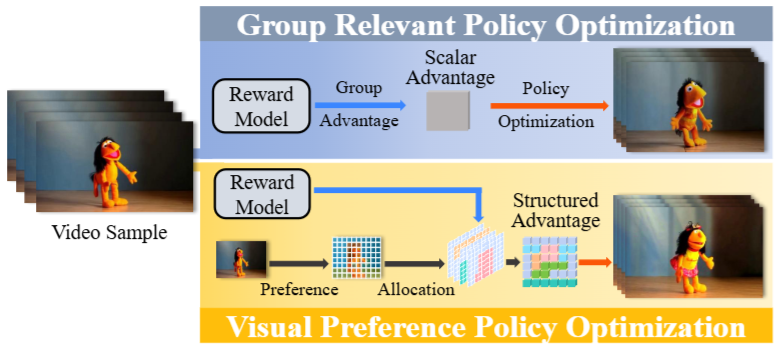
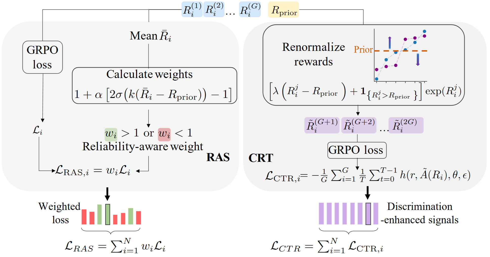
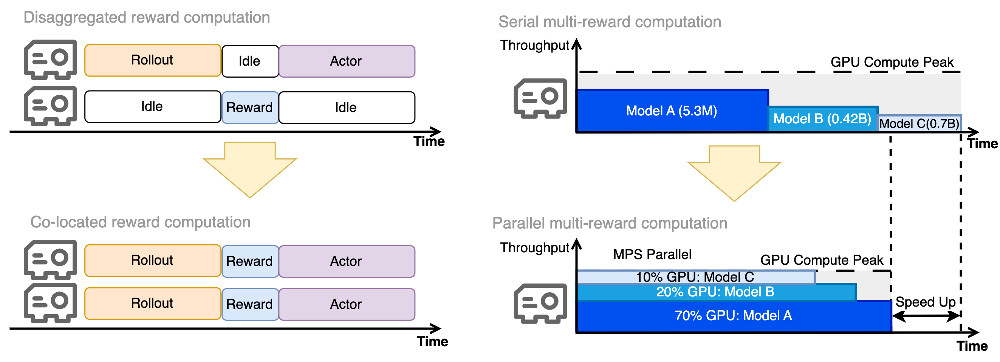
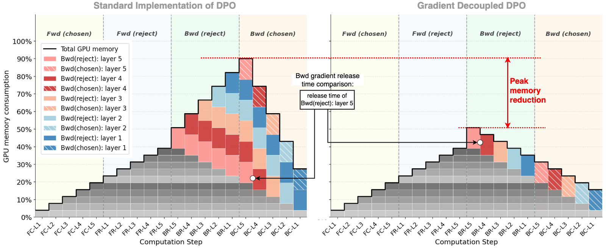

<p align="center">
  <picture>
    <source media="(prefers-color-scheme: dark)" srcset="docs/figures/logo_teleboost.jpeg">
    
  </picture>
</p>
<h3 align="center">
A unified post-training framework for diffusion models
</h3>

<p align="center">
  <a href="https://tele-ai.github.io/TeleBoost/"></a>
  <a href="https://arxiv.org/abs/2602.07595"></a>
  <a href="https://www.apache.org/licenses/LICENSE-2.0"></a>
  <a href="https://github.com/Tele-AI/TeleBoost/actions/workflows/cpu-tests.yml"></a>
  <a href="https://arxiv.org/abs/2511.18919"></a>
  <a href="https://arxiv.org/abs/2511.18719"></a>
</p>

<p align="center">English | <a href="README_ZN.md">中文</a></p>

TeleBoost is a **unified post-training framework for diffusion
models**, with **DPO** and **GRPO** supported.  Used internally at
TeleAI for diffusion-model alignment.

This public branch is physically Wan-only.

* 🎛️ **Multi-paradigm post-training** — DPO + GRPO
* 🔥 **Memory-efficient DPO** — ~40% memory cut, ~15× longer context on Wan 14B
* 🆕 **Six GRPO algorithms** — DanceGRPO, Flow-GRPO, GRPO-Guard, TempFlow-GRPO, **BGPO**, **VIPO**
* 🧩 **Co-located + MPS multi-reward** — N rewards on actor GPU; wall ≈ max(model)
* 🎬 **Ready-to-use sequence parallel** — Ulysses SP for long-video training
* 🚀 **Day-0 BGPO + VIPO (CVPR 2026)**

<p align="center">
  
</p>
<p align="center"><sub><i>
Wan 14B DPO peak memory at 32× 80GB-Hopper GPUs — Decoupled DPO cuts <b>~40%</b>
peak memory on identical workload and scales to <b>~15×</b> longer
context.  See the project page linked in the badges above.
</i></sub></p>

## Methods

<div align="center">

| Method | Status | Use case | Path |
|:-------|:------:|:---------|:-----|
| **DPO** | ✅ Ready | Preference alignment | [`recipes/wan_dpo_teletron/`](recipes/wan_dpo_teletron/) |
| **GRPO** | ✅ Ready | Reward-based optimization | [`recipes/wan_grpo_fsdp/`](recipes/wan_grpo_fsdp/) |
| **TempFlow-GRPO** | ✅ Ready | Noise-aware weighting + trajectory branching ([arXiv 2508.04324](https://arxiv.org/abs/2508.04324)) | [`recipes/wan_tempflow_fsdp/`](recipes/wan_tempflow_fsdp/) |
| **GRPO-Guard** | ✅ Ready | Regulated clipping against implicit over-optimization ([arXiv 2510.22319](https://arxiv.org/abs/2510.22319)); a composable capability, not a standalone recipe | [`teleboost/algorithms/grpo_guard.py`](teleboost/algorithms/grpo_guard.py) |
| **BGPO** | ✅ Ready | Bayesian-prior group optimization (CVPR 2026) | [`recipes/wan_bgpo_fsdp/`](recipes/wan_bgpo_fsdp/) |
| **VIPO** | ✅ Ready | Pixel-weighted dense advantages (CVPR 2026) | [`recipes/wan_vipo_fsdp/`](recipes/wan_vipo_fsdp/) |
| FSDP backend for DPO | 🚧 Roadmap | Memory-efficient sharding without DeepSpeed-ZeRO | — |

</div>

The DPO recipe ships a precision-alignment anchor against the
reference standalone-megatron implementation.  See
[`recipes/wan_dpo_teletron/README.md`](recipes/wan_dpo_teletron/README.md).

## Quickstart

Pick the recipe that matches your post-training need.  The top-level
README is the feature overview; the recipe docs contain the commands,
environment variables, and dataset expectations needed for a real run.

The reference stack uses Python 3.11, PyTorch 2.9.1, CUDA 12.8, and the
exact `verl` source declared in
[`constraints/upstreams/verl.txt`](constraints/upstreams/verl.txt); DPO
uses the Megatron-LM revision in
[`constraints/upstreams/megatron-lm.txt`](constraints/upstreams/megatron-lm.txt).
Follow [`INSTALL.md`](INSTALL.md) rather than letting a generic resolver
replace the CUDA/PyTorch/Ray stack.

* **GRPO** — see [`INSTALL.md`](INSTALL.md).  Set
  `TRAIN_FILE` / `TEST_FILE` / `WAN_MODEL_PATH` / `REWARD_MODEL_PATH`,
  then launch `bash recipes/wan_grpo_fsdp/run.sh` (for a smoke run,
  `TEST_FILE=$TRAIN_FILE` works).
* **DPO** — see
  [`recipes/wan_dpo_teletron/README.md`](recipes/wan_dpo_teletron/README.md).
  Build the Dockerfile, export `MEGATRON_LM_DIR`, then launch
  `bash recipes/wan_dpo_teletron/run.sh`.

Prepare Wan prompt embeddings after installation:

```bash
teleboost-prepare-wan-data \
  --input prompts.txt \
  --output_dir data/processed \
  --wan_model_path /path/to/Wan2.1-T2V-1.3B
```

Run tests by executable environment:

```bash
pytest --profile=core
pytest --profile=training
pytest --profile=heavy --heavy-lane=wan
```

The first two profiles do not certify a production checkpoint.  See
[`tests/README.md`](tests/README.md) and
[`SUPPORT_MATRIX.md`](SUPPORT_MATRIX.md) for the exact validation claims.

### Documentation map

| Need | Start here |
|:-----|:-----------|
| Understand the supported algorithms and system features | This README and [`SUPPORT_MATRIX.md`](SUPPORT_MATRIX.md) |
| Install and run GRPO training | [`INSTALL.md`](INSTALL.md) |
| Program inventory and how each recipe launches | [`recipes/README.md`](recipes/README.md) |
| Understand DPO modes, precision alignment, and troubleshooting | [`recipes/wan_dpo_teletron/README.md`](recipes/wan_dpo_teletron/README.md) |

---

## 🚀 What's new from TeleAI

Four TeleAI contributions ship in this repo: **VIPO** + **BGPO** (day-0
GRPO papers), **co-located reward + MPS** (GRPO systems), and
**Gradient Decoupled DPO** (DPO systems).

### VIPO — Visual Preference Policy Optimization &nbsp;·&nbsp; *GRPO* &nbsp;·&nbsp; CVPR 2026 &nbsp;·&nbsp; [arXiv 2511.18719](https://arxiv.org/abs/2511.18719)

Lifts scalar GRPO feedback into **structured, pixel-level advantages**
via a perceptual structuring module that produces spatially-aware
advantage maps.  See [arXiv:2511.18719](https://arxiv.org/abs/2511.18719).

<p align="center">
  
</p>
<p align="center"><sub><i>
<b>Top</b> — standard Group Relevant Policy Optimization: reward
model output collapses into a scalar advantage before policy update.
<b>Bottom</b> — VIPO: preference signals are allocated into a
structured advantage map, redistributing optimization pressure toward
perceptually important regions.
</i></sub></p>

### BGPO — Bayesian-Prior Group Optimization &nbsp;·&nbsp; *GRPO* &nbsp;·&nbsp; CVPR 2026 &nbsp;·&nbsp; [arXiv 2511.18919](https://arxiv.org/abs/2511.18919)

Two levels of optimization grounded in a **Bayesian prior**:
inter-group **trust allocation** (RAS) and intra-group **prior-anchored
renormalization** (CRT).  See [arXiv:2511.18919](https://arxiv.org/abs/2511.18919).

<p align="center">
  
</p>
<p align="center"><sub><i>
BGPO operates at two levels grounded in a Bayesian prior.
<b>Left (RAS)</b>: group rewards + prior yield per-sample reliability
weights → reliability-aware loss <code>ℒ_RAS</code>.
<b>Right (CRT)</b>: rewards are renormalized against the prior →
recalibrated signal driving the next GRPO loss <code>ℒ_CTR</code>.
</i></sub></p>

### Co-located reward + MPS-parallel multi-reward &nbsp;·&nbsp; *GRPO systems*

**Co-located reward** (workers share actor GPUs) **+ MPS-parallel
multi-reward** (N rewards on one GPU via CUDA MPS).  Eliminates the
idle reward-rank GPU and brings joint wall-time ≈ max(model) instead
of sum.  On by default in joint mode.

<p align="center">
  
</p>
<p align="center"><sub><i>
<b>Left</b>: co-located reward shares the actor GPUs, eliminating the
reward-rank idle gaps. <b>Right</b>: CUDA MPS — N reward models
concurrent on one GPU, wall-time ≈ max(model) instead of sum.
</i></sub></p>

### Gradient Decoupled DPO &nbsp;·&nbsp; *DPO systems*

Per-branch backward + immediate **reduce-scatter** — frees each
branch's full-shape gradient before the next backward starts.
Mathematically equivalent to single-backward; on Wan 14B DPO at
32× 80GB-Hopper GPUs: **~40% peak memory cut** and **~15× longer context**.

<p align="center">
  
</p>
<p align="center"><sub><i>
Per-branch backward + immediate reduce-scatter.  Decoupled DPO frees
each branch's full-shape tensor before the next backward starts —
visibly cutting the peak.  (Result figure is at the top of this README.)
</i></sub></p>

---

## Layout

```
teleboost/          the single production Python package
  programs/         composition root: ProgramSpec binds model family × algorithm × engine × run policy
  engines/          distributed execution engines (fsdp, teletron/Megatron)
  training/         neutral training skeleton (core/) + family adapters (families/)
  algorithms/       algorithm math (grpo, bgpo, vipo, tempflow, grpo_guard, …)
  models/           Wan models and family semantics (attention, sampling, conversion)
  reward/           reward contracts, execution, and providers
  datasets/         datasets, transforms, and Wan data preprocessing
  cli/              installed command entry points
  artifacts/        checkpoint artifact conversion
  config/ patches/  config loading and pinned upstream patches
recipes/            declarative configs + launch scripts; teleboost never imports them
third_party/        vendored upstream sources (own licenses, excluded from release artifacts)
tools/              install / release / smoke / diagnostics scripts (not in the wheel)
tests/              core / training / heavy (wan) pytest profiles
docs/               figures and architecture docs

Dockerfile / makefile / pyproject.toml / requirements.txt   build + deps
LICENSE / NOTICE / CITATION.cff                              upstream attributions
.github/                                                     CI + CODEOWNERS
```

Each program launches via `recipes/<program>/run.sh`; the program
inventory lives in [`recipes/README.md`](recipes/README.md), and the
dependency direction / ownership boundaries in
[`docs/target_architecture.md`](docs/target_architecture.md).

## Release

Build a public sdist and wheel from the current source boundary:

```bash
python -m pip install -c constraints/release.txt -e '.[release]'
python tools/release/build_artifacts.py \
  --out-dir /tmp/teleboost-release-wan
```

The gate stages an allowlisted copy without rewriting it, builds the
wheel only from the extracted sdist, validates archive contents and
notices, runs strict Twine checks, and performs a clean-install CLI
smoke.

Review [`THIRD_PARTY_PROVENANCE.md`](THIRD_PARTY_PROVENANCE.md),
[`MODEL_AND_DATA_LICENSES.md`](MODEL_AND_DATA_LICENSES.md), and
[`SECURITY.md`](SECURITY.md) before publishing or loading external
artifacts.

## License

TeleBoost-authored code is **Apache 2.0** — see [`LICENSE`](LICENSE).
Adapted and vendored code retains its file-level notices and upstream
terms; the root package includes the applicable license texts under
`LICENSES/` and excludes all `third_party/` source.

## Acknowledgments

This project builds on the following upstreams.  Full per-package
attributions (license texts + redistribution terms) are in
[`NOTICE`](NOTICE).

**RL training stacks**

* [`volcengine/verl`](https://github.com/volcengine/verl) — Apache 2.0.  Bytedance's RL training framework; TeleBoost is built as a recipe layer on top.
* [`DanceGRPO`](https://github.com/XueZeyue/DanceGRPO) — Apache 2.0.  TeleBoost's GRPO-family algorithms are in-house implementations of the method DanceGRPO published ([arXiv 2505.07818](https://arxiv.org/abs/2505.07818)); the scaffolding builds directly on upstream verl.
* [`Tele-AI/TeleTron`](https://github.com/Tele-AI/TeleTron) — Apache 2.0.  TeleAI's long-context multi-modal training framework; TeleBoost builds on it and adds Gradient Decoupled DPO.

**Generation models**

* [`Wan-Video/Wan2.1`](https://github.com/Wan-Video/Wan2.1) — Apache 2.0.  Alibaba's Wan2.1 / Wan2.2 video diffusion models, vendored under `third_party/wan/` with the upstream `LICENSE` retained.

**Reward models**

* [`tgxs002/HPSv2`](https://github.com/tgxs002/HPSv2) — Apache 2.0.  Human Preference Score v2.
* [`alibaba-pai/VideoCLIP-XL`](https://huggingface.co/alibaba-pai/VideoCLIP-XL) — CC-BY-NC-SA-4.0 (non-commercial).  Alibaba's video-text alignment model.  This repository does not redistribute its code; the `videoclip` reward loads a copy you place under `third_party/VideoCLIP_XL/` yourself.
* [`Hritikbansal/videophy`](https://github.com/Hritikbansal/videophy) — MIT.  UCLA's video physical-plausibility model.
* [`LAION-AI/aesthetic-predictor`](https://github.com/LAION-AI/aesthetic-predictor) — MIT.  LAION's CLIP + linear-head aesthetic predictor.
* [`princeton-vl/RAFT`](https://github.com/princeton-vl/RAFT) — BSD-3-Clause.  Princeton's optical-flow model, used as a temporal-consistency reward.
* [`TencentARC/VideoAlign`](https://github.com/TencentARC/VideoAlign) — Apache 2.0.  Referenced for reward-model design; not vendored in this repo (pull upstream if you want to train it).

## Citation

```bibtex
@article{teleboost2026,
  title  = {TeleBoost: A Systematic Alignment Framework for High-Fidelity,
            Controllable, and Robust Video Generation},
  author = {Liang, Yuanzhi and Wu, Xuan'er and Liu, Yirui and Fang, Yijie and
            Fan, Yizhen and Hao, Ke and Li, Rui and Liu, Ruiying and Ni, Ziqi and
            Yu, Peng and Wang, Yanbo and Huang, Haibin and Weng, Qizhen and
            Zhang, Chi and Li, Xuelong},
  year   = {2026},
}
```

For per-algorithm citations:

* **GRPO algorithms** (DanceGRPO, Flow-GRPO, GRPO-Guard, TempFlow-GRPO, **BGPO**, **VIPO**) — see [`CITATION.cff`](CITATION.cff).
* **Gradient Decoupled DPO** — cite the TeleBoost paper above.
